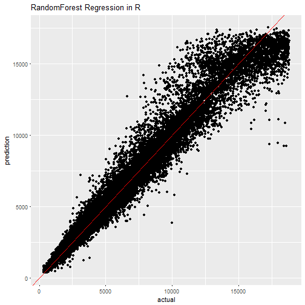

Shiny Application and Reproducible Pitch
=======================================================
author: Lim Wee Pynn
date: 29/06/2018
autosize: true


Overview
========================================================
This is a Shiny application that uses Machine Learning (Random Forest) to predict diamond prices.

To run the application, just choose the inputs of the diamond you want. Program takes a while to load.

Features and Definitions
========================================================
For our prediction model, I have chosen these 6 features: carat, cut, color, clarity, depth, and table. Below are their explanations:       

- Carat: Weight of the diamond (0.2-5.01)
- Cut: Quality of the cut (Fair, Good, Very Good, Premium, Ideal)
- Color: Diamond colour, from J (worst) to D (best)
- Clarity: A measurement of how clear the diamond is (I1 (worst), SI1, SI2, VS1, VS2, VVS1, VVS2, IF (best))
- Depth: Total depth percentage = height / mean(length, width) = 2 * height / (length + width); (43-79)
- Table: Width of top of diamond relative to widest point (43-95)


Build the Random Forest Model (Code)
========================================================


```r
library(caret)
library(randomForest)
library(ggplot2)
data(diamonds)
subsetdata <- diamonds[c(1,2,3,4,5,6,7)]
inTrain <- createDataPartition(subsetdata$price, p = 0.1, list = F)
traindata <- subsetdata[inTrain,]
testdata <- subsetdata[-inTrain, ]
forest <- train(price ~., traindata, method = 'rf', trControl = trainControl(method = 'cv', number = 3))
testdata$predict <- predict(forest, newdata = testdata)
```

Prediction Results (Plot)
=========================================================



  
  
  
